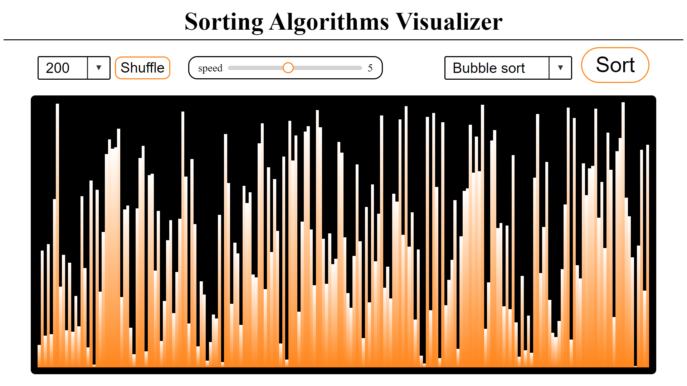

# Sorting Algorithm Visualizer



## Project Description
The ***Sorting Algorithm Visualizer*** is a  tool designed to help users understand and visualize the workings of various sorting algorithms. This web-based application demonstrates the process of sorting data, making complex algorithms easier to grasp.  

The available algorithms:  
1. Bubble sort
2. Selection sort
3. Inserction sort
4. Merge sort
5. Quick sort
6. Heap sort


## Installation
1. Clone the repository:

    ```bash
    git clone https://github.com/SalerSimo/Sorting-Algorithm-Visualizer
    cd Sorting-Algorithm-Visualizer
    ```
## Usage
1. Open file `src/body.html`

2. Choose bar chart size, the algorithm and click **"Sort"**
